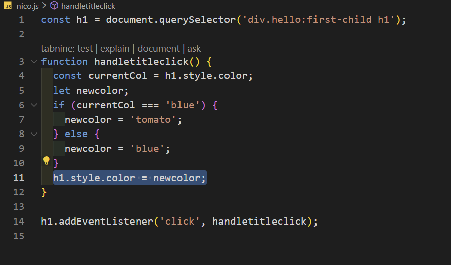

# 3-4

- event listener

      property 이름 앞에 on이 붙어 있다.

### event를 이용하기

1.

2.

title.addEventlistener
(`하고 싶은 무언가,` `함수이름`

ex)

    title.addEventListener('mouseenter', handleMouseEnter);

3. 함수를 만든다.

   function `함수 이름`
   {
   console.log("")
   }

ex)

      function handleMouseEnter() {
    console.log('mouse is here ');
    }

코드

      const title = document.querySelector('div.hello:first-child h1');

      console.log(title);

      function handletitleclick() {
      title.style.color = 'blue';
      }

      function handleMouseEnter() {
      title.innerText = 'mouse is here!';
      }

    function handlemouseleave() {
    title.innerText = 'mouse is not gone!';
    }

    title.addEventListener('click', handletitleclick);
    title.addEventListener('mouseenter', handleMouseEnter);
    title.addEventListener('mouseleave', handlemouseleave);

---

### event를 사용하는 데 두가지 방법

    title.addeventlistener("mouseenter", handletitleclick);

==

    title.onclick=handletitleclick

- devicemotion:

  여러분의 모바일이 움직이거나 할때발생하는 event

- resize

# 2.6

    function handletitleclick() {
    console.log(h1.style.color);
    -->  여기에서는 h1의 color를 획득할 수 있다.

    h1.style.color = 'blue';

    --> 여기서는 h1의 color를 설정할수 있다.

    console.log(h1.style.color);
    }
    -->h1의 color를 다시 가져온다.

if 문으로 색깔 바꾸기

    function handletitleclick() {
    if(h1.style.color === "blue"){
     -->  만약에 색깔이 파랑이 맞으면
    h1.style.color = "tomato";
    --> h1의 color를 tomato로 바꿔줌

    }

const currentCol = h1.style.color;

이 코드를 넣어 색깔의 값을 저장한다.

### result

