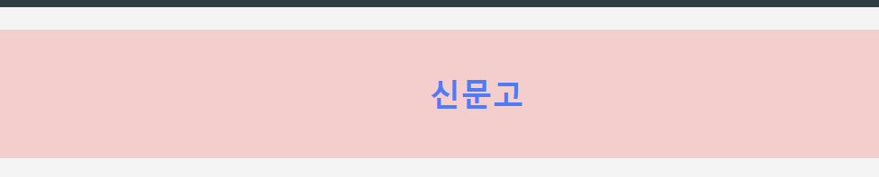
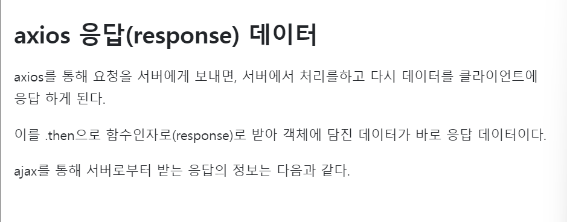

# 프론트 과제

알아야 할거:

- EventListner
- promise(비동기)
- axios
- localstorage

## Event Listner에 대해서 알아보자

1. 첫인상: 나 너 알아. 봤어. 그 니코쌤 event 배울때 봤어.

## 개념

:
nico 썜)

      말 그대로 event를 listen하는거

MDN꺼 찾아 봤는데 무슨 말인지 전혀 모르겠어서.. aws에서 찾아봅니다..

### 개념:

이번트가 발생할때까지 기다린 후 이벤트에 응답하는 javascrinpt함수

이게 좀 정확한 개념 같네요!

## 종류

대표적인 것들을 알아보자면!

- `CLICK` : 요소를 클릭하면이벤트 발생
- `DOMcontentloaded` : 페이지가 새로 로딩될때마다 이벤트 발생
- `SCROLL` :스크롤을 하면 이벤트 발생
- `SUBMIT` : 양식을 전송하면 이벤트 발생
- `load` : html 문서를 완전히 불러왔을때 이벤트 발생

## 사용방법

내가 적어본 사용방법

1.                                                                                                이름.addEventListener(`원하는거 이벤트`+ 함수 이름);
2.                                                                                                function `함수이름`
            {
            console.log("title was clicked!);
            }

## 사용 코드

ex) 아박 메인페이지

    const title1 = document.querySelector('div.hi h1');

    function handleMouseEnter1() {
    title1.innerText = 'mouse enter';
    }

    function handleMouseLeave1() {
    title1.innerText = '신문고';
    }

    title1.addEventListener('mouseenter', handleMouseEnter1);
    title1.addEventListener('mouseleave', handleMouseLeave1);

결과값

--> 마우스를 올렸을때 확대되어 진다

---

# promise(비동기)

## 개념

js에서 promise는 `비동기`적으로 실행하는 작업의 결과를 나타내는 `객체`

---

_비동기란?_

        작업을 요청후 즉시 받지 않고 나중에 받는거

---

## 상태

- 대기: 이행 및 거부가 이루어지지 않은 초기 상태

* 이행: 연산이 완료됨

* 거부: 연산이 실패함

## 사용방법

- 연산을 성공한 경우: `resolve()`

- 실패나 에러: `reject`

---

## 용어설명:

- call stack: 작업이 바로 실행되고 다 실행되면 작업이 빠지는 공간이다.

- callback queue: 비동기 작업이 대기하고 있다가 call stack의 작업이 비어있으면 event loop의 명령에 따라 차례대로 call stack으로 들어가는 공간이다.

- eventloop: 비동기/동기 작업의 순서를 관리하는 역할

* executor: `resolve` 와 `reject`라는 두개의 함수를 매개변수로 받는 실행함수

---

### 서현의promise 정리

: 한마디로 말하면 모아서 한꺼번에 하는거

---> 한꺼번에 하면 시간도 걸리고 비효율적이어서 한꺼번에 받을때까지 기다렸다가 많이 받아서 실행

- resolve : 성공

- reject: 실패

### 그 후에는 어떻게 할까?

`then 메소드`를 사용한다.

        promise.them(successcallback,failurecallback) 이러한 방식으로 콜백을 실행

## : promise객체를 리턴하고 콜백함수를 인수 받는거

## then 메소드 는 어떤 형태일까?

        promise.then(successCallback, failureCallback)

- 성공했을때: successcallback은 promise가 성공했을때

- 실패했을때: failurecallback 실패했을때 콜백 함수

---

### then 메소드의 특징

        changing이 가능하다는것

promise에서 리턴하는과정에서 그 값이 변할수 있다.

### then 메소드 사용코드

        var promise = new Promise(function(resolve, reject) {

        settimeout(function() {

        resolve(1));
        },1000);

        });
        // resolve의 값이 1임

        promise.then(function(num) {
        console.log(num)+ 'complete');
        return num+1; //num값에 1을 더함
        }).then(function(value){
        console.log(value) //값이 2가됨됨
        });

---

# axios

## 정의

: Axios는 브라우저, NODE.js를 위한 promise API를 활용하는 HTTP 비동기 통신라이브러리이다.

_요청과 응답 데잍터의 변형_

## 설치방법

        npm install axios

## 사용법

        axios({
        url: 'https://test/api/cafe/list/today', // 통신할 웹문서
        method: 'get', // 통신할 방식 ex) get, post
        data: { // 인자로 보낼 데이터
        foo: 'diary'
        }
        });

## 용어정리

- method : 요청방식. (get이 디폴트)

### 왜 이걸 알아야할까?

우와. 아까 배운 .then과 함께 쓰구나!

클라이언트(anxios) --> 서버(처리)
<--- //then 함수인자

## axios method 종류

- GET
- POST
- PUT
- DELETE

하나하나씩 알아보자~

---

## GET

정의:

        서버에 어떤 데이터를 받아서 보여줄때 사용

사용법:

- 단순페이지 요청
- 사용자 번호에 따른 조회

ex)

        const postList = async () => {
        const { data } = await axios.post(
                "요청할 주소",
                "보낼 값(객체)",
                {
                        headers: {
                                'Content-type': 'application/json',
                                'Accept': 'application/json'
                        }
                }).then(res => {
                console.log(res.data);
                }).catch(err => {
                console.log(err)
                })
        }

## POST

정의:

        요청주소로 보낼 데이터 객체

- 일반적으로 데이터를 message body에 포함시켜 보낸다.

ex)

        axios.post("url", {
                        firstName: 'Fred',
                        lastName: 'Flintstone'
        })
        .then(function (response) {
                // response
        }).catch(function (error) {
                // 오류발생시 실행
        })

---

## DELETE

정의:
삭제할때

        ex)
        axios.delete('/user?ID=12345')
        .then(function (response) {
        // handle success
        console.log(response);
        })
        .catch(function (error) {
        // handle error
        console.log(error);
        })

---

## PUT & PATCH 의 차이점

- PUT: 리소스를 덮은다

- PATCH: 리소스 일부를 변경

---

# localstorage

정의:

        로컬 스토리지는 브라우저 내에서 영구적으로 데이터를 저장하는데 사용한다.

사용:

        사용자가 웹 앱을을 떠났다가 나중에 돌아올때,
        유용한 데이터를 저장할때 유용 쓴다.

        로그인 한 페이지를 왔을때 다시 로그인 안해도 되고 로그인이 되어있는 상태가 예로 들수 있다.

## 사용방법

로컬 스토리지는 key-value(키-값) 쌍으로 데이터를 저장합니다.

주요 메소드

        * setItem('key',value) : 키, 값 쌍을 보관합니다.

        * getItem('key') : 키에 해당하는 값을 받아옵니다.

        * removeItem('key') : 키와 해당 값을 삭제합니다.

        * key(index): 인덱스에 해당하는 키를 받아옵니다.

        * length: 저당된 항목의 개수를 얻습니다.

        localstorage setIten

사용방법: 2개의 매개변수를 갖는다.

- 첫번째는 매개변수: key 값의 저장될 값의 이름

- 두번째 매개변수: value 값인 실제로 저장될값

        localStorage.setItem("id", idElement);

key값이 저장될 이름: id

value값인 저장된 값: idElement

## session storage

: 저장된 데이터는 브라우저 세션이 유지되는 동안에는 유효

사용자가 브라우저를 닫으면 해당 세션이 종료되며 데이터가 삭제

---

### session storage과 localstorage의 차이점

둘의 차이점은 데이터의 수명

        - localStorage: 사용자가 명시적으로 데이터를 삭제하거나 브라우저 캐시를 삭제하기 전까지 영구적으로 데이터가 유지됩니다.

        - sessionStorage: 세션 기반의 스토리지로, 브라우저 탭이 닫히면 데이터가 삭제됩니다.

---

# ex)

        <!doctype html>

        <textarea style="width:200px; height: 60px;" id="area" placeholder="Write here"></textarea>
        //css

         
        <button onclick="localStorage.removeItem('area');area.
        //area에 해당하는 내용을 삭제

        value=''">Clear</button>
        // 내용을 빈 문자열로 설정하여 화면에 텍스트를 삭제하게 만든다.

        //js

        <script>
        area.value = localStorage.getItem('area');
        //페이지가 로드될때 로컬스토리지에서 area라는 키로 저장된 값을 가져온다.

        area.oninput = () => {
        localStorage.setItem('area', area.value)
        입력된 텍스트를 로컬 스토리지에 저장하는 코드이다.
        };

실행하면 새로고침을 하거나 페이지를 나갔다 들어올때에 textarea의 값이 저장되어 있다.
