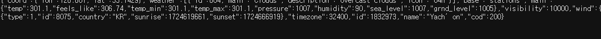

# 노마드 코드를 보고 api 에 대한 정리

## api는?

알아가기전에 api에 대해서 알아보자

    API는 서로 다른 소프트웨어 시스템들이 정보를 주고받거나 기능을 사용할 수 있도록 돕는 일종의 인터페이스입니다.

쉽게 정리를 하자면 _연결해주는 연결체이다._

---

## 니코쌤의 영상을 보고 정리

    navigator.geolocation..getCurrentPosition()

여기서는 두가지의 arguments가 들어가는데

- 모든것이 잘 실행되었을때에 함수

* 에러가 발생했을때 실행되는 함수

succes는 user의 위치를 얻는것이다.

### api key를 만들고 현재 지역과 날씨를 알아보자

https://openweathermap.org/

1. 여기사이트에 들어간다.

2. API를 클릭한후

   https://api.openweathermap.org/data/2.5/weather?lat={lat}&lon={lon}&appid={API key}

이 내용을 복사한다.

3. 중간중간에보면 lat 이랑 lon , API에 대해 `{}`안에 있는것을 볼 수 있는데.

거기안에서 자신의 api를 넣은다.

## 코드

    const API_KEY = 'c13a29e63f11c29530ca28a7ec17a581';
    //API_KEY에설정

    function ongeok(position) {
      //성공적으로 실행됬을때
      const lat = position.coords.latitude;
      //사용자의 위도
      const lng = position.coords.longitude;
      //사용자의 경도

      const url = `https://api.openweathermap.org/data/2.5/weather?lat=${lat}&lon=${lng}&appid=${API_KEY}`;

      //api 부름

      fetch(url).then(response => response.json())
      .then(data => {console.log(data.name, data weather[0].main )});

    }
    function ongeokerror() {
      alert("can't find you. no weather for you");
    }
    //에러가 떴을때
    navigator.geolocation.getCurrentPosition(ongeok, ongeokerror); //함수 불름

결과:

내가 한국에 있다는게 뜬다! 와우!

## fetch에 대해서 더 알아볼까나?

fetch
정의:

    웹 페이지에서 서버와 데이터를 주고받을 수 있게 합니다.

fetch 함수는 두가지 Argument가 있는데

1. 요청을 보낼 대상의 URL을 받고

2. 요청에 대한 옵션을 정의 할수 있는 객체를 받는다.

이 옵션을 통해 HTTP 메서드, 요청 헤더, 본문 데이터등을 설정할 수 있다.

fetch로 인해

- post
- put
- delete
  등을 할수 있는것 같다

## 끝내면서...

전에 가볍게 넘어간 부분이어서 이번에 정리하면서 많은 부분을 알게 됨! 하지만 많은 부분이 더 필요하고 이에 대해 더 절실하게 공부해야한다는 사실에 알게됨.......
