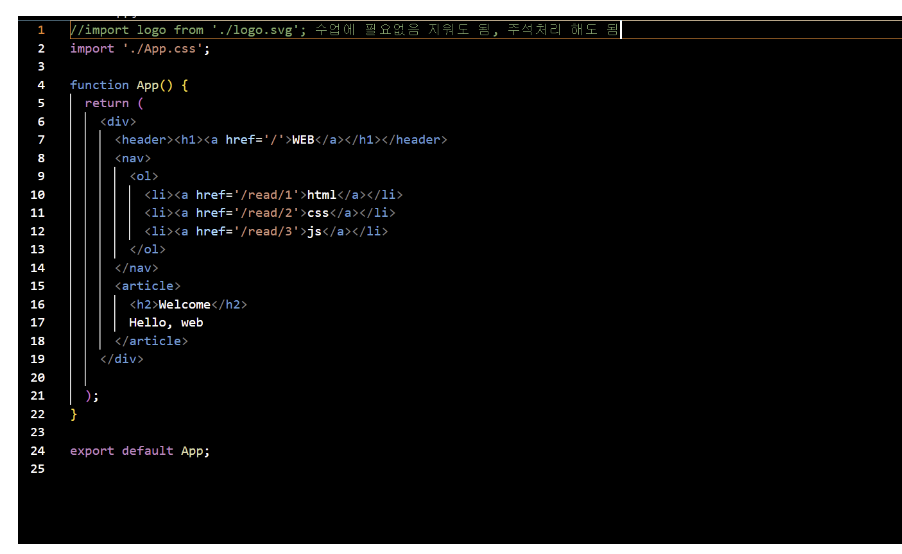
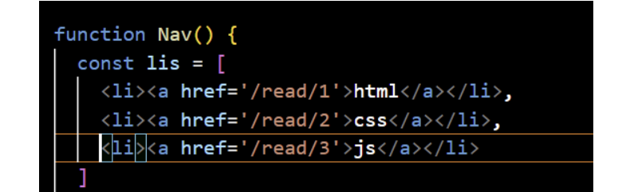
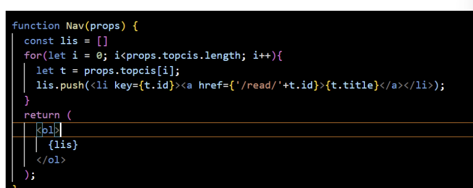

# react

## 컴포넌트

정의: 사용자가 사용하기 위해 직접 만든 태그

    ex) <seohyeon></seohyeon>

이런 느낌

이 코드에 대해서 설명

    return 안에 왜 div로 묵었나

원래 return 안에 다른 코드를 작성하면 안되지만

부모 역할로 div를 묶어서 eturn을 가능하게 하였다.

### 컴포넌트를 쓰기 위해서는 함수가 필요하구나(대문자로 써야한다)

---

# 컴포넌트 사용 방법

1.  함수를 만든다

            funtion seohyeon(){

            }

2.  html 태그로 묶는다

예를 들어 div 태그로 묶거나 ol태그로 묶는다

그냥 내가 봤을때 어떤 태그이던지 묶는것이 답인것 같다

예시 코드

        function article(){
        return(
            <h1>안녕</h1>
        )
        }

---

### 내가 생각하는 컴포넌트 사용의 좋은점

1. 그냥 내가 원하는 이름의 함수를 마음대로 사용할수 있다.

2. 한번 정의하면 여러번 호출할수 있다

## 속성(props)

정의: html에서 쓰는 태그들을 컴포넌트에서는 쓸수 없다.

그래서 컴포넌트를 위한 새로운 태그들이다

## props쓰는 법

1. 함수 가로에 이름을 쓴다

   funtion header(props)

이렇게

2.  중괄호를 사용한다

         <a href='/'{props.title}><a>

이것처럼
`{}` react에서 변수 용도로 쓸려면 {}을 감싸야한다.

        { id: 1, title: 'html', body: 'html is...' },

이 코드에 대한 설명:

`id`: 순서

`title`은 화면에 표시할 리스트

`body`:이벤트하면서 쓰는거

## 요랬다가...

## 요래됐습니당~

### 코드에 대한 설명

예전에 코드를 살펴보자

    이 코드를 보면 딱딱한다.

그 이유는 lis의 값이 3가지로 정해져 있기 때문이다.

_하지만_ `for문`을 이용해서 값을 더 부드럽게 만들어 볼것이다

바뀐 코드

     for (let i = 0; i < props.topics.length; i++)

length속성(글자수) 개수를 통해 양이 안정해 있는것이 되었다.

# event

조건= 기능

        onchangeMode(속성)(조건)=function(함수)(기능 )

이게 뭔 말이냐면

`속성`은 내가 원하는 거

`조건`은 event가 발생할수 있는 조건

`기능`은 event 기능

이런것이다.

### 컴포넌트에 이벤트 기능을 넣는법

ex)

        <Header
                title="web"
                onChangeMode={function () {
                alert('Header');
                }}
            />

`function(함수)(기능)`

# state

무섭다....

완벽한 정의 state: `출력`

좀 더 세세한 정의: `props`값이 실시간으로 변환다

--> 새로고침을 안해도 된다

완전 럭키비키

        title="web"
            onChangeMode={function () {
            mode = 'WELCOME';
            }}
        />
        <Nav
            topics={topics}
            onChangeMode={(id) => {
            mode = 'READ';
            }}'

우리는 이벤트를 활용해 버튼을 누르면 값으 변하는것을 할려고 한다.

하지만 안된다.

### 왜안돼?

## 정답은...

state를 사용해야한다.

좀 더 자세히 말하면

app 함수 자체가 재실행이 안되기 때문이다. => 코드를 바뀌어도 업데이트가 안된다? 이정도
